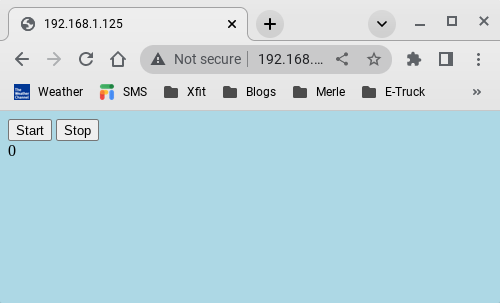

# Off-Grid Garden Watering System
This project is an off-grid garden watering system.

An example system using a spike well is detailed [here](https://hackaday.io/project/187079-off-grid-garden-watering-system).

You can run a demo of the system [here](https://merliot.net/projects/garden).

## Get
```
$ git clone https://github.com/merliot/projects.git
```

## Build
```
$ cd projects/garden
$ ./build
```
Builds the binary ~/go/bin/garden

## Run
```
$ cd projects/garden
$ ~/go/bin/garden
[dc_a6_32_7a_a6_d0] Merle version: v0.0.46
[dc_a6_32_7a_a6_d0] Model: "garden", Name: "eden"
[dc_a6_32_7a_a6_d0] Received [SYSTEM]: {"Msg":"_CmdInit"}
[dc_a6_32_7a_a6_d0] Basic HTTP Authentication enabled for user "merle"
[dc_a6_32_7a_a6_d0] Public HTTP server listening on port :80
[dc_a6_32_7a_a6_d0] Skipping public HTTPS server; port is zero
[dc_a6_32_7a_a6_d0] Private HTTP server listening on port :6000
[dc_a6_32_7a_a6_d0] Skipping tunnel to mother; missing host
[dc_a6_32_7a_a6_d0] Received [SYSTEM]: {"Msg":"_CmdRun"}
```

## View
Running started a web server listening on port :80. 

Web browse to the web server address to view the user interface.  In this case, I'm browsing to 192.168.1.125 on the local network.


